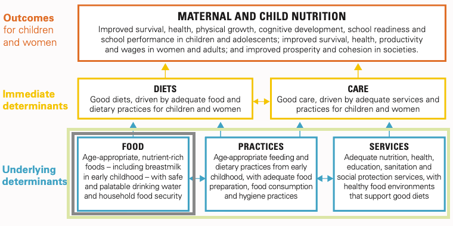
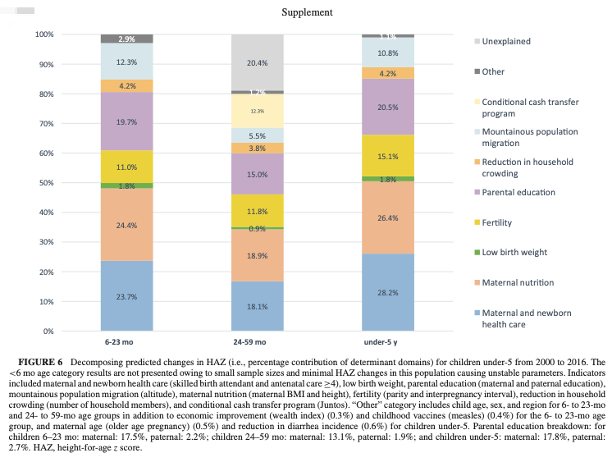
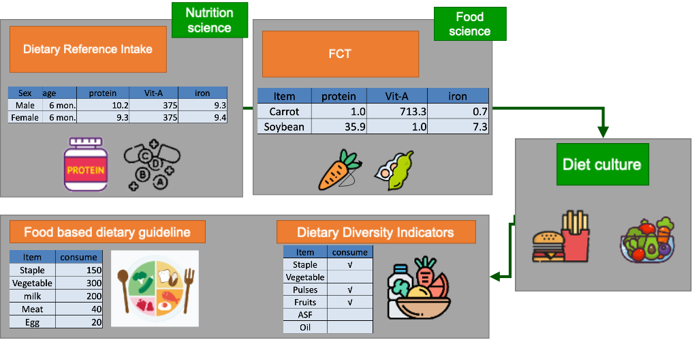
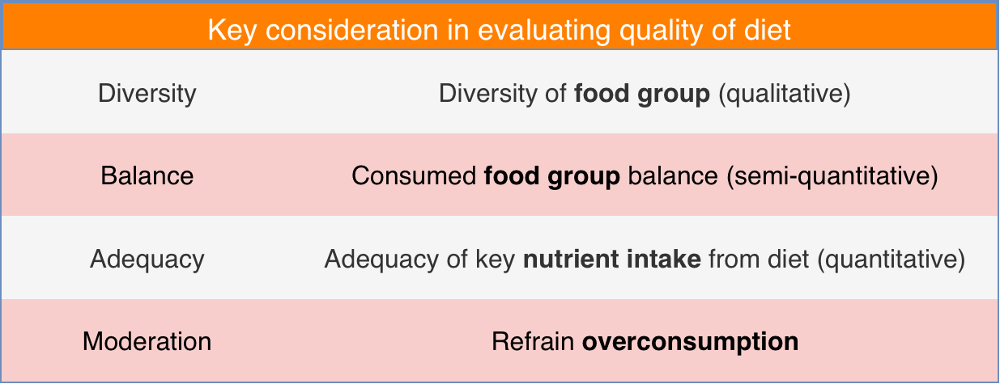
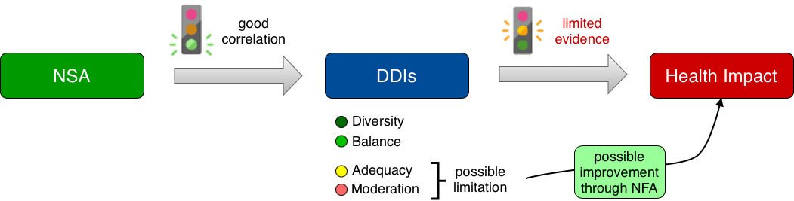

## Overall structure of my thesis {.fragile}

1.  Background
2.  Research interest
3.  \alert{Factor analysis of stunting reduction focusing on food consumption (IV: CCT program participation rate)}
4.  Impact of multisector intervention on stunting reduction
5.  2SLS focusing on interaction
6.  Impact of CRECER program in stunting reduction
7.  PSM-DID for impact assessment of CRESER program
8.  Mediation analysis to assess contribution of CRECER program
9.  Discussion

## Table of contents {.fragile}

1.  Background
2.  Research interest
3.  Data and methodology
4.  Result
5.  Discussion

# Background

## Current status {.fragile}

-   Malnutrition is one of the world’s most serious but least-addressed development challenges. Its human and economic costs are enormous, falling hardest on the poor, women, and children.
-   South Asia and Sub-Saharan Africa are the hardest hit, with with roughly two-thirds of the 150.2 million stunted children residing in these two regions(World bank).
-   The economic costs of undernutrition are significant with at least \$1 trillion a year because of productivity loss due to undernutrition and micronutrient deficiencies (FAO 2013).
-   From meta-analysis of 37 international study, it is revealed that stunting was strongly linked to household food insecurity and poor dietary diversity (2025, islam et. al).
-   Meanwhile, it is well known that other various factors including mother’s education status, access to clean water and toilet, economic disparity, fragile agro-ecosystem have also significant impact on malnutrition.

## Why we need multisector intervention? {.fragile}

### three key factors are associated with undernutrition

{width="80%"}

## Peru case study {.fragile}

### Key factors associated with undernutrition in Peru

{width="50%"}

## Different type of dietary guidance {.fragile}

{width="90%"}

## How to evaluate quality of diet? {.fragile}

::: {#tbl-evaluate-diet}
{width="90%"}

Key consideration in evaluating quality of diet
:::

## Is Dietary Diversity Score effective tool to assess diet quality? {.fragile}

-   Ruel conducted intensive review of 47 articles to examine impact of various agriculture intervention to nutrition improvement. Overall, number of studies showed clear impact of NSA to DDIs, while impact on nutrition outcome was limited (Ruel, 2018)
-   Eric conducted peer review from 137 articles to examine relationship between DDIs and health impact, found that associations between DDIs and health outcomes were largely inconsistent (Eric, 2021)

{width="90%"}


```{r}
#| include: false

library(gtsummary)
library(survey)

gdrive_dir <- "/Users/snakada/Library/CloudStorage/GoogleDrive-snakada@g.ecc.u-tokyo.ac.jp/マイドライブ/Peru_work/Peru_endes/spss"
save_path  <- file.path(gdrive_dir, "output", "lasso_IV01")

gt_pre  <- readRDS(file.path(save_path, "descriptive_stat_pre.rds"))
gt_post <- readRDS(file.path(save_path, "descriptive_stat_post.rds"))

# 行番号で分割（6行目と12行目の後で分割）
tbl_split_pre <- gt_pre %>%
  tbl_split_by_rows(row_numbers = c(8, 16, 22, 28))

tbl_split_post <- gt_post %>%
  tbl_split_by_rows(row_numbers = c(8, 16, 22, 28))

# 整形して画像保存  
for (i in seq_along(tbl_split_pre)) {
  tbl_split_pre[[i]] |>
    as_gt() |>
    gt::cols_width(
      label ~ gt::px(400)
    ) |>
    gt::tab_options(
      table.width     = gt::px(900),
      table.font.size = 13
    ) |>
    gt::gtsave(
      filename = paste0("image/fig_tbl_pre_", i, ".png"),
      vwidth   = 1200,
      vheight  = 600
    )
}

for (i in seq_along(tbl_split_post)) {
  tbl_split_post[[i]] |>
    as_gt() |>
    gt::cols_width(
      label ~ gt::px(400)
    ) |>
    gt::tab_options(
      table.width     = gt::px(900),
      table.font.size = 13
    ) |>
    gt::gtsave(
      filename = paste0("image/fig_tbl_post_", i, ".png"),
      vwidth   = 1200,
      vheight  = 600
    )
}

```

```{r}
#| results: asis
source("../../my_code/func/create_table_slide_final.r")

for (i in seq_along(tbl_split_pre)) {
  image_path <- paste0("image/fig_tbl_pre_", i, ".png")
  tbl_number <- paste0("1-", i)
  caption <- paste0("Descriptive statistics(pre) part-", i)
  slide_title <- paste0("Descriptive statistics ", i, " (pre)")
  create_table_slide(
    image_path = image_path,
    caption = caption,
    table_number = tbl_number,
    slide_title = slide_title,
  )
}

for (i in seq_along(tbl_split_post)) {
  image_path <- paste0("image/fig_tbl_post_", i, ".png")
  tbl_number <- paste0("2-", i)
  caption <- paste0("Descriptive statistics(post) part-", i)
  slide_title <- paste0("Descriptive statistics ", i, " (post)")
  create_table_slide(
    image_path = image_path,
    caption = caption,
    table_number = tbl_number,
    slide_title = slide_title,
  )
}

```

