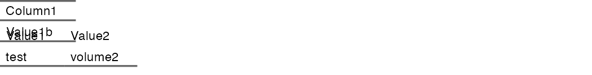

## How to evaluate quality of diet? {.fragile}

```{r}
library(flextable)
library(magrittr)
library(dplyr)

# パネルA用のデータフレーム（4列）
panelA_df <- data.frame(
  Item = c("Diversity", "Balance", "Adequacy", "Moderation"),
  Description = c(
    "Diversity of food group (qualitative)",
    "Consumed food group balance (semi-quantitative)",
    "Adequacy of key nutrient intake from diet (quantitative)",
    "Refrain overconsumption"
  ),
  Type = c("Qualitative", "Semi-quant", "Quantitative", "Qualitative"),
  Score = c(85, 78, 92, 70)
)

# パネルB用のデータフレーム（2列）
panelB_df <- data.frame(
  Indicator = c("Overall Diet Quality", "Food Security", "Nutrition Security"),
  Status = c("Good", "Moderate", "Good")
)

# パネルBに不足する列をNAで補完
panelB_expanded <- panelB_df %>%
  mutate(
    Item = NA,
    Description = NA,
    Type = NA,
    Score = NA
  ) %>%
  select(names(panelA_df))

# パネルラベル行を作成
panel_label <- data.frame(
  Item = "Panel A: Dietary Assessment Components",
  Description = NA,
  Type = NA,
  Score = NA
)

panel_label_b <- data.frame(
  Item = "Panel B: Summary Indicators",
  Description = NA,
  Type = NA,
  Score = NA
)

# すべての行を結合
combined_df <- bind_rows(
  panel_label,
  panelA_df,
  panel_label_b,
  panelB_expanded
)

# Flextableの作成と列の削除
ft <- flextable(combined_df) %>%
  theme_booktabs() %>%
  delete_columns(j = c("Type", "Score"))  # 正しい構文：j引数を使用

# パネルラベルの書式設定
ft <- bg(ft, i = ~ grepl("Panel", Item), bg = "#E89850", part = "body")
ft <- color(ft, i = ~ grepl("Panel", Item), color = "white", part = "body")
ft <- bold(ft, i = ~ grepl("Panel", Item), part = "body")
ft <- merge_h_range(ft, i = ~ grepl("Panel", Item), j1 = "Item", j2 = "Description")

# ヘッダーの書式設定
ft <- bg(ft, part = "header", bg = "#E89850")
ft <- color(ft, part = "header", color = "white")
ft <- bold(ft, part = "header")

# 交互の行に背景色
ft <- bg(ft, i = ~ !grepl("Panel", Item) & seq_along(Item) %% 2 == 1, 
         bg = "#F5E6D3", part = "body")

# パディングと列幅の調整
ft <- autofit(ft)
ft <- padding(ft, padding = 4, part = "all")

ft
```

## second table {.fragile}

```{r}
#| include: false
source("../../myTools.R")

# 1行1列のデータセット例
single_cell_df <- data.frame(
  Column1 = c("Value1b"))

ft_single <- flextable(single_cell_df) %>%
  theme_booktabs() %>%
  autofit()

ft_double <- data.frame(
    Column1 = c("Value1", "test"),
    column2 = c("Value2", "volume2")
  ) %>% 
  flextable() %>%
  theme_booktabs() %>%
  delete_part(part = "header") %>%
  autofit()

result <- combine_flextables_cairo(
  ft_list = list(ft_single, ft_double),
  output_file = "image/single_cell.png"
)

```

{width="100%"}
