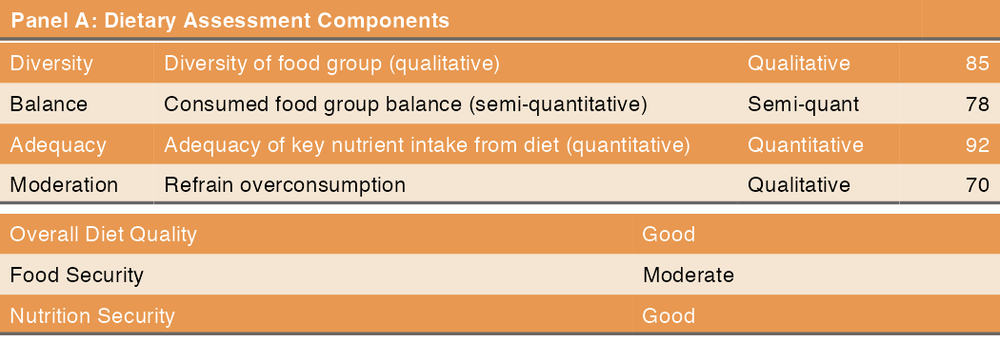

## How to evaluate quality of diet? {.fragile}

```{r}
library(flextable)
library(magrittr)
library(dplyr)

# パネルA用のデータフレーム（4列）
panelA_df <- data.frame(
  Item = c("Diversity", "Balance", "Adequacy", "Moderation"),
  Description = c(
    "Diversity of food group (qualitative)",
    "Consumed food group balance (semi-quantitative)",
    "Adequacy of key nutrient intake from diet (quantitative)",
    "Refrain overconsumption"
  ),
  Type = c("Qualitative", "Semi-quant", "Quantitative", "Qualitative"),
  Score = c(85, 78, 92, 70)
)

# パネルB用のデータフレーム（2列）
panelB_df <- data.frame(
  Indicator = c("Overall Diet Quality", "Food Security", "Nutrition Security"),
  Status = c("Good", "Moderate", "Good")
)

# パネルBに不足する列をNAで補完
panelB_expanded <- panelB_df %>%
  mutate(
    Item = NA,
    Description = NA,
    Type = NA,
    Score = NA
  ) %>%
  select(names(panelA_df))

# パネルラベル行を作成
panel_label <- data.frame(
  Item = "Panel A: Dietary Assessment Components",
  Description = NA,
  Type = NA,
  Score = NA
)

panel_label_b <- data.frame(
  Item = "Panel B: Summary Indicators",
  Description = NA,
  Type = NA,
  Score = NA
)

# すべての行を結合
combined_df <- bind_rows(
  panel_label,
  panelA_df,
  panel_label_b,
  panelB_expanded
)

# Flextableの作成と列の削除
ft <- flextable(combined_df) %>%
  theme_booktabs() %>%
  delete_columns(j = c("Type", "Score"))  # 正しい構文：j引数を使用

# パネルラベルの書式設定
ft <- bg(ft, i = ~ grepl("Panel", Item), bg = "#E89850", part = "body")
ft <- color(ft, i = ~ grepl("Panel", Item), color = "white", part = "body")
ft <- bold(ft, i = ~ grepl("Panel", Item), part = "body")
ft <- merge_h_range(ft, i = ~ grepl("Panel", Item), j1 = "Item", j2 = "Description")

# ヘッダーの書式設定
ft <- bg(ft, part = "header", bg = "#E89850")
ft <- color(ft, part = "header", color = "white")
ft <- bold(ft, part = "header")

# 交互の行に背景色
ft <- bg(ft, i = ~ !grepl("Panel", Item) & seq_along(Item) %% 2 == 1, 
         bg = "#F5E6D3", part = "body")

# パディングと列幅の調整
ft <- autofit(ft)
ft <- padding(ft, padding = 4, part = "all")

ft
```

## second table {.fragile}

```{r}
#| include: false
library(flextable)
library(magrittr)
library(dplyr)
library(gridExtra)
library(grid)


# ******************************************************************************
#' @description: flextableの列幅を比例スケーリングで調整する関数
#' @param ft flextableオブジェクト
#' @param ft_out 保存する画像ファイル名
#' @param target_width 目標の全体幅（インチ単位）
#' @return 列幅を調整したflextableオブジェクト
# ******************************************************************************
scale_ft <- function(ft, ft_out, target_width) {
  # 各列の幅を取得（内部構造から）
  col_widths <- ft$body$colwidths
  # 現在の合計幅
  current_total <- sum(col_widths)
  # 比例スケーリング
  scaled_widths <- col_widths * target_width / current_total
  # スケーリングした幅を適用
  ft <- width(ft, j = 1:length(scaled_widths), width = scaled_widths)
  # save_as_image(ft, path = paste0("image/", ft_out), webshot = "webshot2")
  return(ft)
}
# ----関数ここまで--------------------------------------------------------------
# ******************************************************************************
#' @description: 複数のflextableオブジェクトを隙間なく結合し、PNG画像として保存
#' @param ft_list flextableオブジェクトのリスト
#' @param output_file 保存先ファイルパス
#' @param width 出力画像の幅（インチ単位、デフォルト：7）
#' @param dpi 解像度（デフォルト：150）
#' @param row_height 1行あたりの高さ（インチ単位、デフォルト：0.3）
#' @return TRUE（成功時）
# ******************************************************************************
combine_flextables_cairo <- function(ft_list, output_file, width = 7, dpi = 150, row_height = 0.3) {
  library(flextable)
  library(gridExtra)
  library(grid)
  library(ragg)
  
  # 入力チェック
  if (!is.list(ft_list) || length(ft_list) == 0) {
    stop("ft_list は空でないリストである必要があります")
  }
  
  for (i in seq_along(ft_list)) {
    if (!inherits(ft_list[[i]], "flextable")) {
      stop(paste("ft_list[[", i, "]] はflextableオブジェクトではありません"))
    }
  }
  
  # grob化
  grob_list <- lapply(ft_list, function(ft) {
    gen_grob(ft, fit = "fixed")
  })
  
  # 各flextableの行数に基づいて高さを推定
  heights_in <- numeric(length(ft_list))
  
  for (i in seq_along(ft_list)) {
    ft <- ft_list[[i]]
    nrows <- 0
    
    # bodyデータの行数のみを取得（header/footerは除外）
    if (!is.null(ft$body$dataset)) {
      nrows <- nrow(ft$body$dataset)
    } else if (!is.null(ft$body$content)) {
      if (is.data.frame(ft$body$content)) {
        nrows <- nrow(ft$body$content)
      } else if (is.list(ft$body$content)) {
        nrows <- length(ft$body$content)
      }
    }
    
    # body行のみの高さを計算（マージンなし）
    heights_in[i] <- max(nrows * row_height, 0.3)
  }
  
  # PNG画像のサイズを計算
  png_width <- as.integer(width * dpi)
  png_height <- as.integer(sum(heights_in) * dpi)
  
  # PNG保存
  ragg::agg_png(
    output_file,
    width = png_width,
    height = png_height,
    res = dpi
  )
  
  # grid.arrange()で結合
  heights_unit <- unit(heights_in, "inches")
  
  do.call(
    grid.arrange,
    c(
      grob_list,
      list(
        nrow = length(grob_list),
        heights = heights_unit
      )
    )
  )
  
  dev.off()
  
  cat("✓ 画像を保存しました:", output_file, "\n")
  cat("✓ ピクセルサイズ:", png_width, "x", png_height, "\n")
  cat("✓ テーブル数:", length(ft_list), "\n")
  
  return(TRUE)
}

# ----関数ここまで--------------------------------------------------------------

# パネルA用のデータフレーム（4列）
panelA_df <- data.frame(
  Item = c("Diversity", "Balance", "Adequacy", "Moderation"),
  Description = c(
    "Diversity of food group (qualitative)",
    "Consumed food group balance (semi-quantitative)",
    "Adequacy of key nutrient intake from diet (quantitative)",
    "Refrain overconsumption"
  ),
  Type = c("Qualitative", "Semi-quant", "Quantitative", "Qualitative"),
  Score = c(85, 78, 92, 70)
)

# パネルA用のタイトル用データフレーム（1列）
panelA_title_df <- data.frame(
  Item = "Panel A: Dietary Assessment Components",
  Description = NA,
  Type = NA,
  Score = NA
)

# パネルB用のデータフレーム（2列）
panelB_df <- data.frame(
  Indicator = c("Overall Diet Quality", "Food Security", "Nutrition Security"),
  Status = c("Good", "Moderate", "Good")
)

# 共通の列幅（スライド1枚に収まる程度で調整）
col_width_desc  <- 7.0   # in 単位

## パネルA
ft_A <- flextable(panelA_df) %>%
  theme_booktabs() %>%
  autofit()

ft_A <- delete_part(ft_A, part = "header") %>%
  bg(part = "body", bg = "#F5E6D3") %>%
  bg(i = c(1, 3), part = "body", bg = "#E89850") %>%
  color(i = c(1, 3), part = "body", color = "white")

ft_A <- scale_ft(ft_A, "table_A.png", col_width_desc)

# パネルのタイトル
ft_A_title <- flextable(panelA_title_df) %>%
  theme_booktabs() %>%
  delete_part(part = "header") %>%
  bg(part = "body", bg = "#E89850") %>%
  color(part = "body", color = "white") %>%
  bold(part = "body") %>%
  autofit()

ft_A_title <- scale_ft(ft_A_title, "table_A_title.png", col_width_desc)

## パネルB
ft_B <- flextable(panelB_df) %>%
  theme_booktabs() %>%
  autofit()

ft_B <- delete_part(ft_B, part = "header") %>%
  bg(part = "body", bg = "#F5E6D3") %>%
  bg(i = c(1, 3), part = "body", bg = "#E89850") %>%
  color(i = c(1, 3), part = "body", color = "white")

ft_B <- scale_ft(ft_B, "table_B.png", col_width_desc)


result <- combine_flextables_cairo(
  ft_list = list(ft_A_title, ft_A, ft_B),
  output_file = "image/tables_combined.png",
  width = 7,
  dpi = 150,
  row_height = 0.3
)

```


{width="100%"}
